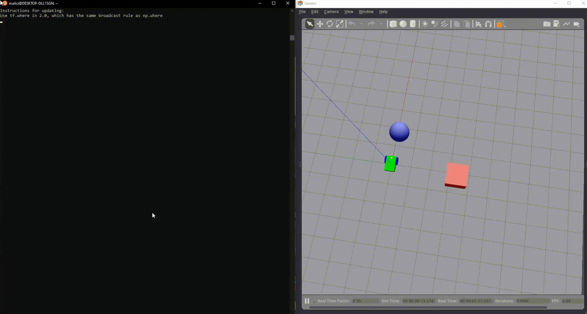
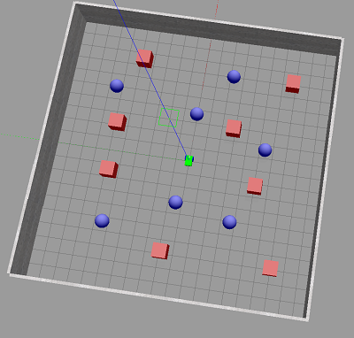
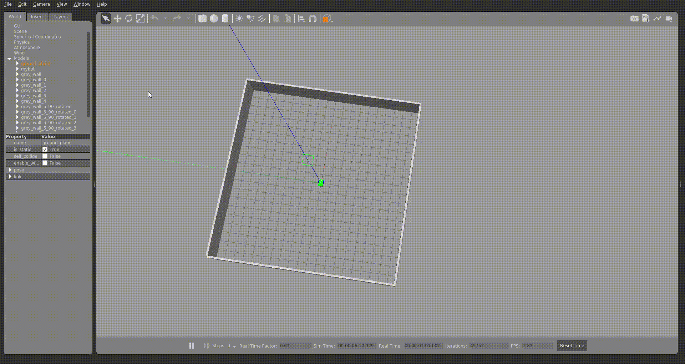

# Autonomous Navigation using Deep Learning
A neural-network controller that steers the car based on visual input obtained from the camera sensor. First, a neural network predicts the object that the car confronts and then the controller detemines the next action accordingly. Developed at the top of the [fork](https://github.com/aderabiruk/autonomous-navigation) as a warm-up for our EE492 Senior Project at Bogazici University.



## Getting Started
These instructions will show you how to run the application on your development machine.
### Prerequisites
1. ROS Melodic
2. Python 2.7
3. A package manager. Pip is recommended.


### Installation
1. Create a Catkin workspace,
    ```
    mkdir -p ~/autonav_ws/src
    cd autonav_ws
    catkin_make 
    ```
2. Source the ```setup.bash``` file so that the ROS recognizes the workspace. You should perform this step each time you open a new terminal instance,
    ```
    source ~/autonav_ws/devel/setup.bash 
    ```
    For convenience, you may consider running the following so that bash does it for you.
    ```
    echo 'source ~/autonav_ws/devel/setup.bash' >> ~/.bashrc 
    source ~/.bashrc
    ```
2. Clone the project to ```/src``` directory,
    ```
    cd ~/autonav_ws/src
    git clone https://github.com/mehmetalici/autonomous-navigation.git
    ```
3. Install package dependencies.

    Create a virtual environment using pip:
    ```
    python -m pip install --upgrade pip 
    python -m pip install --user virtualenv 
    roscd autonomous_navigation
    python -m virtualenv env
    source ./env/bin/activate 
    ```
    Confirm your interpreter:
    ```
    which python
    >> ...autonomous-navigation/env/bin/python
    python --version
    >> python 2.7.xx
    ```
    Then, install dependencies:
    ```
    pip install rospkg scipy==1.2.2 scikit-build keras==2.3.1 tensorflow==1.15.0 pillow opencv-python==4.2.0.32 pathlib 
    ```
3. Obtain a neural network model. The neural network model is not included in Git repo due to its size. Therefore, you can apply either of the following:
    
    **First Option: Build a new model.** Simply run:
    ```
    roscd autonomous_navigation/scripts
    python Shape_Classifier.py
    ```
    Note that training takes around 1-2 minutes.

    **Second Option: Download our pre-trained model**: https://drive.google.com/file/d/1eiGGMFkl_IvPHtl0rFOmlZsLFT7jwsVg/view?usp=sharing
    
    Then, extract to ```scripts``` directory:
    ```
    roscd rosautonomous_navigation/scripts
    unzip /path/to/downloaded/model.zip .
    ```

4. Now, launch the world:
    
    1. Unzip the grey wall model that we use to border our world to ~/.gazebo/models:
    ```
    roscd autonomous_navigation
    unzip grey_wall.zip ~/.gazebo/models -r
    ```
    2. Launch the world with objects by,
    ```
    roslaunch autonomous_navigation gazebo_object.launch
    ```
    After the above command, following world should appear:

    
5. Finally, open a new terminal and run the neural-network controller by,
    ```
    source ~/autonav_ws/devel/setup.bash # If you didn't add this line to ~/.bashrc
    roscd autonomous_navigation
    source ./env/bin/activate
    python ./scripts/Navigation.py
    ```
    This will run our autonomous steering algorithm. 


### Configuration
    
If you desire to play around and place the objects as you wish, you can spawn a bordered world by,  
```
roslaunch autonomous_navigation gazebo.launch
```

Then, use Model Editor http://gazebosim.org/tutorials?tut=model_editor to create blue unit sphere and red unit box models. Save your models and place them on the map by drag-and-drop as desired:



After you are done, start the controller,

```
roscd autonomous_navigation/scripts
python Navigation.py
```


Note that the controller was trained **only** to recognize these objects, therefore, any other object will most likely lead the controller to fail. 


## Training For New Objects
Our training categories are limited and the project provides you with software tools to enrich your dataset very easily.

### Data Logging
1. Launch an empty world,
    ```
    roslaunch autonomous_navigation gazebo.launch
    ``` 
2. Let your new object be a ```Dinasaur```. Drag and drop the Dinasaur onto the ground. 

3. Edit your car position (from GUI) so that it faces your new object.
4. Generate images from the car's camera sensor,  

    ```
    rosrun autonomous_navigation Navigator.py --train-for Dinasaur
    ``` 
    This will recursively generate timestamped png images to ```./datasets/training/Dinasaur/``` directory. 
5. To increase varieties within one category, stop the script, slightly change the car's pose and rerun the script with the same arguments. Thanks to timestamps, your old data will not be overridden.

6. Do not forget to log data with the same strategy for test dataset. To generate test data, run the script with,
    ```
    rosrun autonomous_navigation Navigator.py --test-for Dinasaur
    ``` 
### Training
Once you are satisfied with your png images, open ```Shape_Classifier.py``` and increment the ```NUMBER_OF_CLASSES``` constant. Then, just run the script to train your new model. 

You don't need to configure training code for your new class. In fact, during data logging, our script helps Keras to work its magic by exporting the new object's data into its own subfolder under ```training``` or ```test``` folders. Then, before training, Keras automatically recognizes these subfolders as prediction categories, which, in our case, are  ```Space```, ```Box```,  ```Sphere```, ```Border``` and your new object ```Dinasaur```. Finally during training, Keras flows png images in batches from these subdirectories for training and testing.

After you are finished with training, you will see your new model ```nn_controller.h5``` exported into our filesystem. You can now launch a new world, and then run ```Navigator.py``` to see the results in simulation.


## Acknowledgements
This project was forked from the work at https://github.com/aderabiruk/autonomous-navigation. 

We use the following components from that project,
* Project architecture
* ROS Package-related files
* Car bot with its dynamics
* NN architecture and training code  
* Car navigation code

Our project extends the initial work by,
* a camera image logging and labelling interface that leads to easy training for new classes with command-line arguments,
* datasets for ```Space```, ```Box```,  ```Sphere```, and ```Border``` classes,
* a model trained over the dataset and achieved agreeable results on the simulation,  
* a 'bordered' world and 'filled-with-objects' world,
* a comprehensive README.

## Authors
Mehmet Yasar Alici [Github](github.com/malici), [Email](myasar.alici@gmail.com)


## License
Our work is licensed under MIT License. We encourage researchers to take the code and extend the project as they wish. #FutureIsOpenSource 
